# 🕵️‍♂️ DeceptiNet — Automated Threat Deception & Response Platform

> *Lure. Observe. Automate. Respond.*

DeceptiNet is an **automated cyber deception platform** that baits attackers with fake credentials, captures their full behavior in a honeypot, and instantly blocks them while alerting your SOC — all orchestrated through MITRE CALDERA, HashiCorp PAM, and Shuffle SOAR.

Built for **red team exercises**, **purple teaming**, **threat hunting labs**, and **SOC automation testing**.

---

## 🚀 Features

✅ **MITRE ATT&CK-Aligned Attacks**  
Simulates real-world credential harvesting, lateral movement, and privilege escalation using **CALDERA**.

✅ **Credential Deception Layer**  
Deploys **fake credentials via HashiCorp Boundary + Vault** — exposed as decoy accounts to lure attackers.

✅ **Full Behavior Capture**  
Redirects attackers to **T-Pot honeynet** — logs every command, payload, and exploit for forensic analysis.

✅ **Automated Incident Response**  
Uses **Shuffle SOAR** to:
- 🔒 Block malicious IPs at the **Boundary PAM layer**
- 📩 Trigger **n8n workflows** for **Slack & Email alerts**

✅ **Real-Time TTP Visualization**  
Dashboards in **Grafana** fed by **Loki logs** from T-Pot, Boundary, and Vault — visualize attacker Tactics, Techniques, and Procedures live.

✅ **Infrastructure as Code**  
Deployable via **Ansible + Kubernetes** — scalable, reproducible, cloud-ready.

---

## 🧩 Architecture Overview

```mermaid
graph LR
    A[Security Engineer] -->|Python Script| B[CALDERA]
    B -->|Credential Harvesting| C[HashiCorp Boundary + Vault]
    C -->|Fake Creds Trigger| D[T-Pot Honeynet]
    D -->|Logs| E[Loki]
    E --> F[Grafana Dashboards]
    F -->|Alert| G[Shuffle SOAR]
    G --> H[Block IP via Boundary]
    G --> I[Trigger n8n → Slack/Email]
```



> 💡 *Tip: Replace this with an actual architecture diagram image in your repo.*

---

## 🛠️ Tech Stack

| Category         | Tools                                                                 |
|------------------|-----------------------------------------------------------------------|
| **Orchestration**| Python, Ansible, Kubernetes                                           |
| **Attack Sim**   | MITRE CALDERA                                                         |
| **PAM Layer**    | HashiCorp Boundary, HashiCorp Vault                                   |
| **Honeypot**     | T-Pot (Multi-honeypot platform)                                       |
| **Monitoring**   | Grafana, Loki, Promtail                                               |
| **SOAR**         | Shuffle                                                               |
| **Notifications**| n8n (Slack, Email, Teams, etc.)                                       |
| **Deployment**   | Helm, Docker, K8s                                                     |

---

## ⚙️ Installation & Setup

### Prerequisites

- Docker + Docker Compose
- Kubernetes cluster (Minikube or cloud-based)
- Python 3.9+
- VMware or VirtualBox (optional for VM-based honeypots)

---

### 1. Clone the Repo

```bash
git clone https://github.com/yourusername/DeceptiNet.git
cd DeceptiNet
```

---

### 2. Deploy with Ansible

```bash
ansible-playbook deploy.yml -i inventory.ini
```

> 📁 Includes roles for:
> - CALDERA setup
> - Boundary + Vault fake credential injection
> - T-Pot deployment
> - Loki + Grafana stack
> - Shuffle + n8n integration

---

### 3. Launch Attack Simulation

```bash
python3 launch_attack.py --target decoy-server-01 --tactic credential-access
```

---

### 4. Access Dashboards

- **Grafana**: `http://localhost:3000` → view attacker TTPs
- **Shuffle**: `http://localhost:3333` → monitor/playbook execution
- **T-Pot**: `http://localhost:64297` → raw honeypot logs

---

### 5. Configure Alerts

Edit `playbooks/shuffle/block_ip_and_alert.yaml`:

```yaml
steps:
  - name: Block IP at Boundary
    action: boundary.block_ip
    args:
      ip: "{{ alert.source_ip }}"
  - name: Send Slack Alert
    action: n8n.trigger_webhook
    args:
      url: "https://n8n.yourcompany.com/webhook/slack-alert"
      payload:
        text: "🚨 DeceptiNet Alert: Attacker {{ alert.source_ip }} blocked after honeypot interaction."
```

---

## 🤝 Contributing

We welcome contributions! Here’s how:

1. Fork the repo
2. Create your feature branch (`git checkout -b feature/AmazingFeature`)
3. Commit your changes (`git commit -m 'Add some AmazingFeature'`)
4. Push to the branch (`git push origin feature/AmazingFeature`)
5. Open a Pull Request

Please ensure your code follows PEP8 and includes documentation.

---

## 📜 License

Distributed under the **MIT License**. See `LICENSE` for more information.

---

## 📬 Contact

**Hafedh Guenichi** — [your.email@example.com](mailto:your.email@example.com)  
Project Link: [https://github.com/yourusername/DeceptiNet](https://github.com/yourusername/DeceptiNet)

---

## 🌟 Acknowledgments

- MITRE for CALDERA
- HashiCorp for Boundary + Vault
- T-Pot Community
- Shuffle & n8n teams
- Inspired by CyberLab academic project (PFA.pdf)

---

> 💡 **Pro Tip**: Add a `demo.gif` or `architecture.png` in your repo root and link it under “Architecture Overview” for instant visual impact.

---
